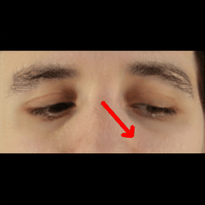

# Learning Gaze-aware Compositional GAN from Limited Annotations 

> Gaze-annotated facial data is crucial for training deep neural networks (DNNs) for gaze estimation. However, obtaining these data is labor-intensive and requires specialized equipment due to the challenge of accurately annotating the gaze direction of a subject. In this work, we present a generative framework to create annotated gaze data by leveraging the benefits of labeled and unlabeled data sources. We propose a Gaze-aware Compositional GAN that learns to generate annotated facial images from a limited labeled dataset. Then we transfer this model to an unlabeled data domain to take advantage of the diversity it provides. Experiments demonstrate our approach's effectiveness in generating within-domain image augmentations in the ETH-XGaze dataset and cross-domain augmentations in the CelebAMask-HQ dataset domain for gaze estimation DNN training. We also show additional applications of our work, which include facial image editing and gaze redirection.

<p align="center">
</a>
</p>

## Description

Official implementation of Learning Gaze-aware Compositional GAN from Limited Annotations 

## Installation

- Python 3
- Pytorch 1.10
- Run `pip install -r requirements.txt` to install additional dependencies.


## Model training

#### Data preprocessing

We use [ETH-XGaze dataset](https://files.ait.ethz.ch/projects/xgaze/xucongzhang2020eccv.pdf) as the labaled dataset for training GC-GAN. It can be downloaded from https://ait.ethz.ch/xgaze.  
The dataset contains raw high-resolution images and already preprocessed images. We use these preprocessed images in our experiments and four camera perspectives.

Once the data is downloaded, we need to have two folders, one containing RGB images and another containing the corresponding segmentation masks with the same file names (pixel values correspond to face component ID).
The .h5 files from the ETH-XGaze dataset can be processed with the following command:

``python data/segment_face_db_ethx.py  /data_dir/ /prep_data_dir/rgb /prep_data_dir/mask ``

In case of using CelebA dataset for the second stage, first download the [dataset](https://github.com/switchablenorms/CelebAMask-HQ).
Once downloaded, the same preprocessing can be done using the following command to generate output folders with rgb and mask images:

``python data/segment_face_db_celeb.py  /data_dir/ /prep_data_dir/rgb /prep_data_dir/mask ``


#### Training dataset preparation

Training dataset preparation requires the following two steps.

1 - Prepare dataset: we use LMDB datasets for training, which can be generated with the following command:

``python prepare_mask_data.py /prep_data_dir/rgb /prep_data_dir/mask --out=/dataset_lmdb/ --size=256``

This command will save the lmdb dataset in the path defined as argument (--out) as well as a labels_gaze.npy file with gaze labels information.

2 - Prepare the inception data for FID estimation during training:

``python prepare_inception_conditional.py /dataset_lmdb/ --output=/dataset_lmdb.pkl --size=256 --dataset_type=mask``

#### Training GC-GAN

Train GC-GAN with gaze-annotated data

``python train_conditional.py --dataset=/dataset_lmdb --inception=/dataset_lmdb.pkl --checkpoint_dir=ckpt_output --seg_dim=6 --size=256 --residual_refine --batch=2``

The training output (checkpoints and generated images) will be saved in the path defined for checkpoint direction (--checkpoint_dir). The number of segmentation dimensions (--seg_dim) should be the same used when preprocessing data and generating segmentation masks.


##### Training the second stage

Train GC-GAN with unlabeled data, starting from the training checkpoint already generated in the first stage.

``python train_conditional_stage2.py --dataset=/dataset_lmdb --inception=/dataset_lmdb.pkl --checkpoint_dir=ckpt_output --seg_dim=6 --size=256 --residual_refine --batch=2 --ckpt=/pretrained_ckpt_path/xxxx.pt --gaze_labels=/pretrained_lmdb_db/labels_gaze.npy``

Additional parameters are: checkpoint pretrained with the labeled dataset (--ckpt) and pretraining dataset's gaze file (--gaze_labels), as labels are randomly selected from the training distribution.
The training output (checkpoints and generated images) will be saved in the path defined for checkpoint direction (--checkpoint_dir). The number of segmentation dimensions (--seg_dim) should be the same used when preprocessing data and generating segmentation masks.

## Synthesis

#### Generate gaze-conditioned random images

We provide a script for sampling random images and their corresponding segmentation masks given a random gaze direction. The gaze direction is sampled from the training labels distribution (labels_gaze.npy is required). This can be done with the following command:

``python generate/generate_conditional.py /path_to_model/xxx.pt --outdir=results --sample=8 --gaze_lbs=/path_to_db/labels_gaze.npy  --save_latent``

By using the flag save_latent, the script will also save the local latent vector of each sample (.npy file).

<p align="center">
 
</p>

#### Generate local latent interpolations

We provide a script for visualizing the local interpolation of any face component or gaze, which can be done as follows:

``python generate/generate_video_conditional.py /path_to_model/xxx.pt --outdir=results_interp --latent=results/000000_latent.npy --gaze_lbs=/path_to_db/labels_gaze.npy``

The latent code (latent flag) can be any generated with the previous script (generate_conditional.py). The script generates different gifs in the
output folder with the animation of each specific face component and gaze. The following examples show modifications on nose compontent and gaze direction.
 
<p align="center">
 
</p>

<p align="center">
 
 
</p>

### Credits

**SemanticSytleGAN implementation:**  
https://github.com/seasonSH/SemanticStyleGAN  
Copyright (C) 2022 ByteDance Inc.
Licensed (CC BY-NC-SA 4.0) https://github.com/seasonSH/SemanticStyleGAN/blob/main/LICENSES/LICENSE

**StyleGAN2 model and implementation:**  
https://github.com/rosinality/stylegan2-pytorch  
Copyright (c) 2019 Kim Seonghyeon  
License (MIT) https://github.com/rosinality/stylegan2-pytorch/blob/master/LICENSE  

**LPIPS model and implementation:**  
https://github.com/S-aiueo32/lpips-pytorch  
Copyright (c) 2020, Sou Uchida  
License (BSD 2-Clause) https://github.com/S-aiueo32/lpips-pytorch/blob/master/LICENSE  

**ReStyle model and implementation:**  
https://github.com/yuval-alaluf/restyle-encoder  
Copyright (c) 2021 Yuval Alaluf  
License (MIT) https://github.com/yuval-alaluf/restyle-encoder/blob/main/LICENSE  

**Please Note**: The CUDA files are made available under the [Nvidia Source Code License-NC](https://nvlabs.github.io/stylegan2/license.html)


### Acknowledgments

This code is initialy built from [SemanticStyleGAN](https://github.com/seasonSH/SemanticStyleGAN/)

### Citation

If you use this code for your research, please cite the following work:
```
@article{aranjuelo2024learning,
  title={Learning Gaze-aware Compositional GAN from Limited Annotations},
  author={Aranjuelo, Nerea and Huang, Siyu and Arganda-Carreras, Ignacio and Unzueta, Luis and Otaegui, Oihana and Pfister, Hanspeter and Wei, Donglai},
  journal={Proceedings of the ACM on Computer Graphics and Interactive Techniques},
  volume={7},
  number={2},
  pages={1--17},
  year={2024},
  publisher={ACM New York, NY, USA}
}
```